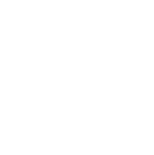

# 🐱 Luz Siolari de Lima Coelho

## 💻 About Me
- 🏳️‍⚧️ Pronouns: She/Her
- 📧 Contact: luzsiolaricoelho@outlook.com
- 🎓 Systems Development student @ Etec Peruíbe
- 🌎 Advanced English (Wizard)
- 🔭 Passionate about web development and open source

## 🛠️ Tech Stack

**💽 OS & Tools**  

  

**🖥️ Frontend**  

  

**⚙️ Backend**  

**📱 Mobile**  

  

**🔧 Development Tools**  

---

## 🏆 Projects | Projetos

  <table style="width: 100%; border-collapse: collapse; margin: 1.5rem 0;">
    <thead>
      <tr>
        <th style="padding: 12px; text-align: left;">Project</th>
        <th style="padding: 12px; text-align: left;">Description</th>
      </tr>
    </thead>
    <tbody>
      <!-- PhysApp Project -->
      <tr style="border-bottom: 1px solid #ddd;">
        <td>
          <a
          href="https://github.com/PhysAppDev"
          style="display: flex; flex-direction: column; justify-content: center; align-items: center; cursor: pointer;">
            
            <strong>PhysApp</strong>
          </a>
        </td>
        <td style="padding: 12px; vertical-align: middle;">
          
🇺🇸 A mobile physics calculus resolver app.

          
🇧🇷 Um aplicativo mobile resolvedor de cálculos de física.

        </td>
      </tr>
      <!-- Portal Wakai Project -->
      <tr style="border-bottom: 1px solid #ddd;">
        <td>
          <a
          href="https://github.com/PortalWakai"
          style="display: flex; flex-direction: column; justify-content: center; align-items: center; cursor: pointer;">
            
            <strong>Portal Wakai</strong>
          </a>
        </td>
        <td style="padding: 12px; vertical-align: middle;">
          
🇺🇸 Project developed within a three days time-period for the Hackathon 2025 of Etec Peruíbe.
          

          
🇧🇷 Projeto desenvolvido no período de 3 dias para o Hackathon 2025 da Etec de Peruíbe.
          

        </td>
      </tr>
    </tbody>
  </table>

---

## 📊 GitHub Stats  

  
  

---

  

    <ul style="list-style-type: none; margin: 0; padding: 0">
      <li style="text-align: right"><a href="#top">[ ⬆️ Back to Top</a></li>
      <li style="text-align: right">🌟 <strong>Thanks for visiting!</strong></li>
    </ul>
    |
    <ul style="list-style-type: none; margin: 0; padding: 0">
      <li style="text-align: left"><a href="#top">Voltar ao Topo ⬆️ ]</a></li>
      <li style="text-align: left"><strong>Obrigada pela visita!</strong> 🌟</li>
    </ul>
  

---
